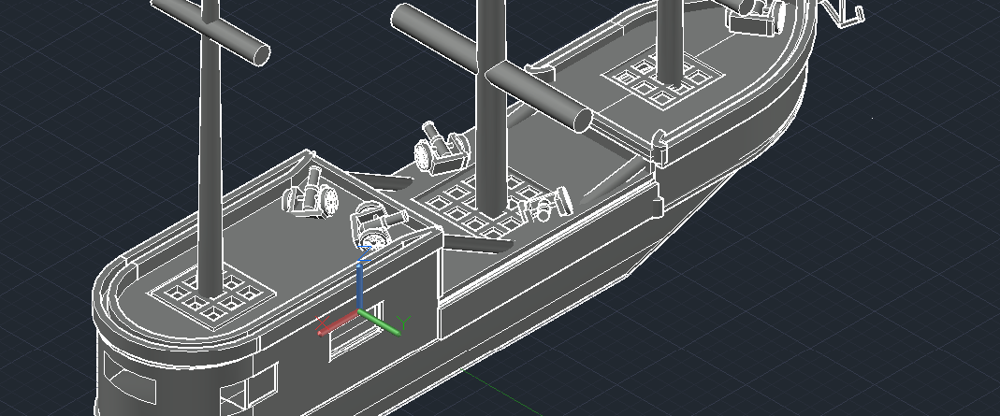
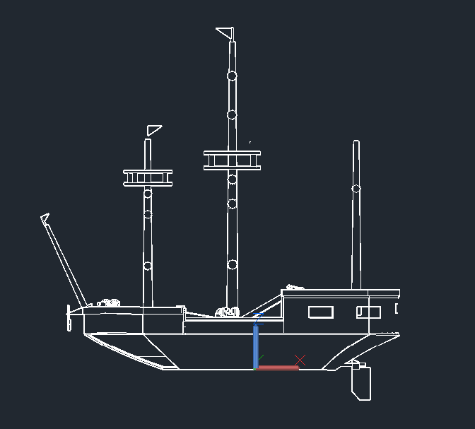
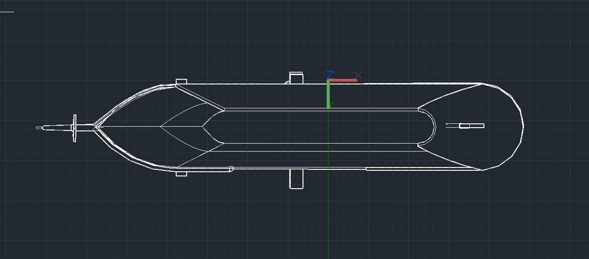
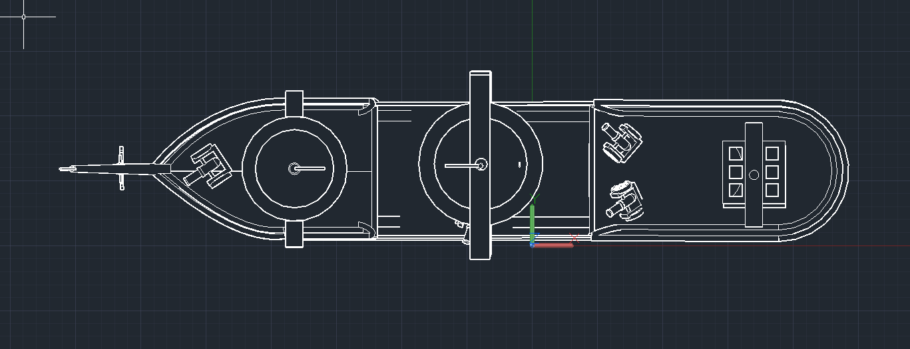
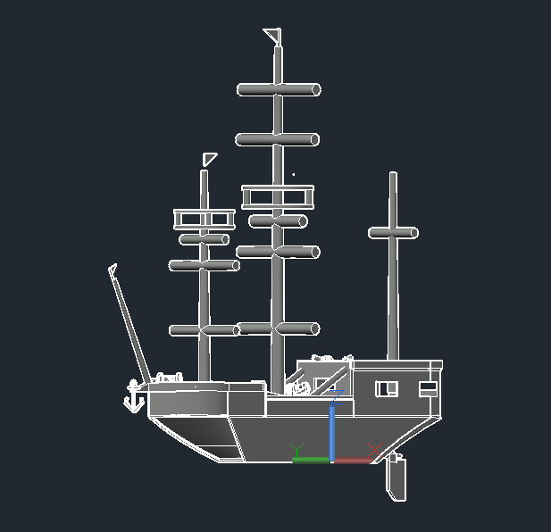
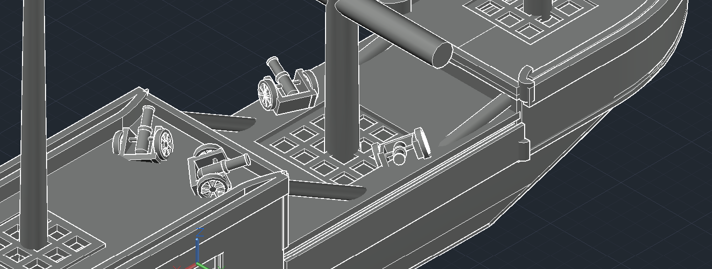
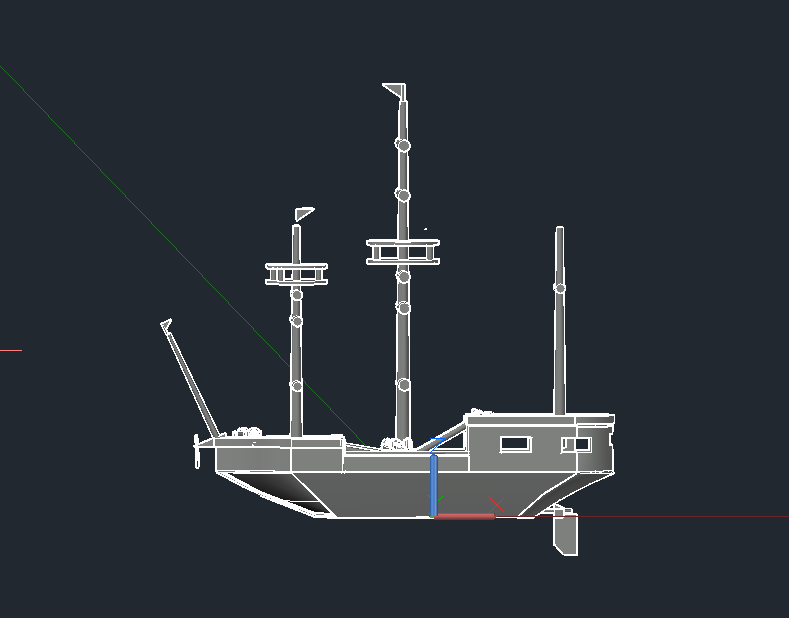

# 3D Pirate Ship - AutoCAD 3D

## Overview
- **Course:** Engineering Design and Drawing  
- **Time Taken:** 8 hours  
- **Software Used:** AutoCAD 3D  

## Image Gallery

<table border="0">
  <tr>
    <td></td>
    <td></td>
    <td></td>
  </tr>
  <tr>
    <td></td>
    <td></td>
    <td></td>
  </tr>
  <tr>
    <td></td>
    <td></td>
    <td></td>
  </tr>
</table>

## Download DWG File
[Click here to download the DWG file](sideview.dwg)
## Download STL File
[Click here to download the STL file](final project ship.stl)

---

